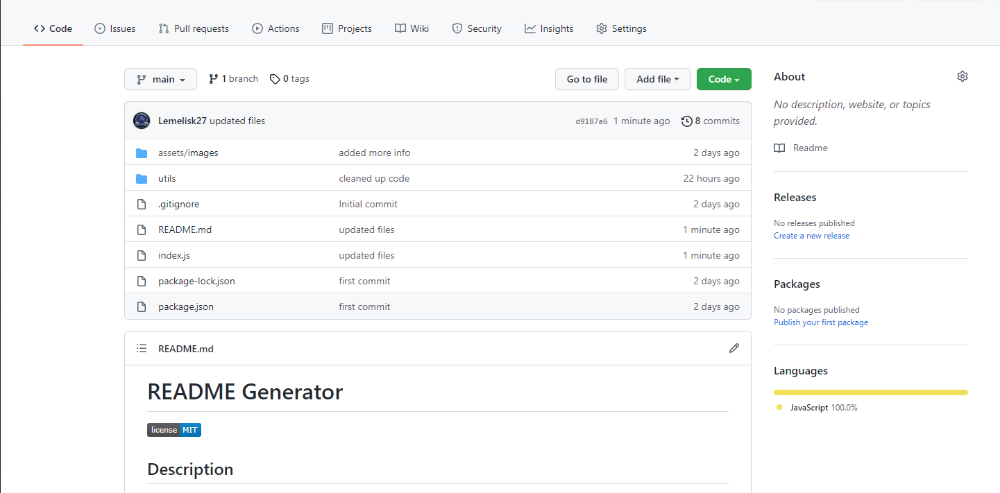

# README Generator - [Usege Video](https://watch.screencastify.com/v/pzZ4PF8k9TKlZwKqMCPQ)

## Description
This is an application that creates a README file based on user input.
## Table of Contents
- [Installation](#installation)
- [Usage](#usage)
- [Credits](#credits)
- [License](#license)
## Installation
npm i
## Usage
node index.js  

## Credits
Zach Smith - [GitHub Profile](https://github.com/Lemelisk27)
## License
This product is licensed under the MIT license.
## How to Contribute
None at this time.
## Tests
Test at your own risk.
## Questions
If you have any questions you can contact me directly at Lemelisk27@gmail.com. You can find more of my work at [Lemelisk27](https://github.com/Lemelisk27)
